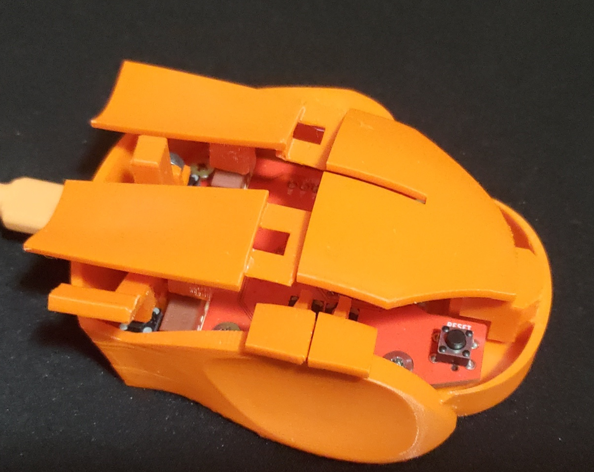
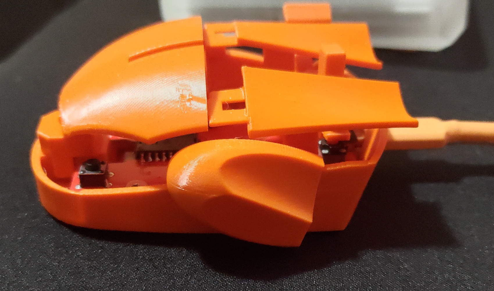
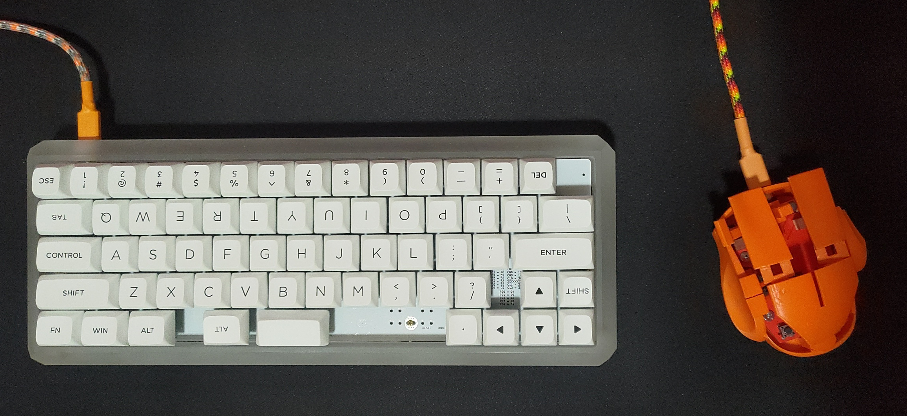

# Fireball mouse





Small PMW3360 fingertip mouse with a magnetic hall sensor joystick for scrolling and single 'fire' button for enter.

Designed for Kailh Mute silent switches (the small 6-7mm box ones) and regular sized mouse switches for left/right click (12-13mm x 5-6mm). Bottom is designed for 4 feet with mounting screws near the back middle for the top shell. The top shell is open for minimal hand contact and weight reduction with no 'middleman' shell.

# Building / Parts

### Part List

 - PWM3360 (desolder from donor or grab some off aliexpress)
 - Kailh Quiet Mute Micro Switches (https://www.kailhswitch.com/micro-switches/mouse-micro-switches/quiet-mute-micro-switches.html - aliexpress or elsewhere)
 - USB4085-GF-A (digikey or newark if out of stock on jlcpcb)
 - M3 0.5x4mm screws (PCB and shell mounting - https://www.amazon.com/gp/product/B0C1SGKGWZ)
 - M3 16mm socket screws (for joystick mount - https://www.amazon.com/gp/product/B07PZ3XXPF)
 - N50 magnets 4x1mm cylinder (aliexpress, alibaba, kj magnets)
 - ABS or PC+PBT 3D printing filament (PushPlastic PBT is what I used for my final version. Spool is not compatible with Bambu AMS btw :])
 - Huano Yellow Dot switches (aliexpress, almost linear if not directly 90 degrees of force - optional)
 - TS02-66-50-BK-160-SCR-D (digikey or newark, small 6mm switch for reset/boot - optional)

### Building

May need tweaking for every printer and filament combo. The bambu project in the [stl](./stl) directory should give the orientations and settings that I used to print.

**general print guide**

 - 0.16mm layer height
 - print bottom separate
 - print top separate
 - print small pieces and side clicks together
 - print left/right clicks together
 - 33mm/s outer shell and overhangs
 - support on the the right finger grip
 - support on the thumb, USB and bottom+top screw mounts (auto worked for these)
 - 6 bottom layers for the bottom
 - rotations for the fire/flip, joystick and clicks are important! (joystick will likely break from screw force if in wrong orientation)

**cleanup**

 - bottom screw mount supports can be punctured and twisted out
 - bottom left thumb overhang needs sanding after support is removed
 - left/right click contacts can be sanded, washed, and electrical taped. But click contact can be very finicky (especially with 'huano yellow dot' switches, I eventually gave up and opted to use the raw plastic). This was the hardest part of 'feel' to get right. Contacts may need moved left/right if you use a 12mm omron style switch vs a kailh square switch.
 - side (forward/backward) clicks support can be a bit messy if you wait for it to cool. Removing supports while warm was easier for me in general but should be done here since the part is small and is less likely to warp or deform while still warm.
 - fire button, side clicks and joystick mount are press fit: print smaller test fits before or you'll have to rig some electrical tape for loose fits, or sand (or break) parts on tight fits.
 - magnetic joystick will need tape over the USB connector to make sure it doesn't contact it. The hall sensor routes **under** the joystick faces **away** from the joystick magnets. Technically the wrong direction, but it works great for me. Another sensor can be placed on the side but is best suited in a similar location on the other side of the joystick. See [ideal locations here](./img/halls.png). The code for the joystick/scroll-stick has been updated to read 10 times and use a +- margin to auto-adjust values for scroll up+down. Logic or values may need changed if the magnets are in different polarity or the sensors are positioned differently (reading different ranges).
 - magnets may need test fits depending on print tolerances. Mine were snug and required no glue to stay in place which is perfect. Make sure they are centered and in the right positions (north/south).
 - if your joystick is squeaky or doesn't move smoothly, sanding the inside with the screw's threads may help. Sanding the edges of the bottom or where parts may rub can help also.
 - tightening PCB mounts should be done evenly and just enough to work with everything else
 - tightening top mounts should be done evenly and just enough to work with clicks, every mm counts for feel here

The PCB will likely not line up 100% !!! Tolerances can vary and you are not always going to get the exact same thing if you don't pay for high tolerances.

Be sure to test fit anyway because anything may be off slightly and it could matter!

# QMK

### Setup

Copy **this** project's qmk `fireball` directory to **qmk_firmware**'s `ploopy` directory.

```sh
git clone https://github.com/qmk/qmk_firmware.git

cp -r qmk/keyboards/ploopyco/fireball qmk_firmware/keyboards/ploopyco/
```

### Compile

In `qmk_firmware`

```sh
qmk compile -kb ploopyco/fireball -km default
```

### Flash

The first time you connect the RP2040 it should be empty and go into boot mode. Once flashed, pressing 'forward' while connecting to USB will enter boot mode, reset/boot buttons may help with a reconnect and boot if needed.

Mount the RP2040 and copy `qmk_firmware/.build/ploopyco_fireball_default.uf2` to the RP2040.

```sh
sudo mount /dev/sda1 /mnt/usb && sudo cp .build/ploopyco_fireball_default.uf2 && sudo umount /mnt/usb
```

# FreeCAD

The finished parts are meshed and provided in the [stl](./stl) directory.

Most of this was copied from my original version. The left and right finger grips were slightly modified but I didn't bother reinventing them because they worked for years great. A lot of confusing FreeCAD methods that you can do one way but not another were used to get make parts. The 'misc' group are left over parts that may break the child parts, test fittings and wires used to sweep/loft/extrude and create cuts and parts.

# KiCAD / jlcpcb

Exporting gerbers/drills is the same as every project I've seen, however for jlcpcb I found multiple tutorials and they all seemed out of date. I used [wokwi's jlcpcb script](https://github.com/wokwi/kicad-jlcpcb-bom-plugin) to make placement files, but still needed to rotate them when setting the PCB assembly up.

- File > Fabcrication outputs > component placement (to /tmp/fireball-components)
- `./kicad_pos_to_cpl.py /tmp/fireball-components/Fireball-top-pos.csv /tmp/fireball-jlcpcb-placement-pos.cmp.csv`

The [jlcpcb](./jlcpcb) directory should be a good start to upload for boards.

You may need to replace some parts if they are out of stock. I think I had to use a TexasInstrument converter instead of one in the BOM.

You will have to trim the 4-pin USB header or desolder for it to fit properly in the shell. This is more for a backup or if you do not want to use a USB-C connector and want a straight wire from mouse to the PC USB. If you do not want a raw cable connection, I would remove it from BOM or PCB before exporting.

# Improvements

- PMW3360 bottom mount is slightly off for me and could be moved/centered better.
- The extra PMW3360 mount square groove in the middle is probably useless and could be removed.
- Thumb groove could be extended up a bit at a 45 degree angle. Your thumb can touch the 'back' button since you are not always flat. I don't accidentally press it and it is not that noticeable or bothersome, but it could be something to look at.
- Hall sensor placement could be better. If the PCB is redone, it may be better to put 2 sensors on the side or directly in front+behind the joystick if possible.
- Fire/flip/enter and joystick may feel better if a bit taller. Left/Right clicks ended up being higher than expected.
- Left/Right click feel is more precise to adjust than I expected. Part of this is due to the light weight top and back mounting. The double prong mounts that commercial mice use help prevent rocking side-to-side which created a very uneven, unpredictable and bad click feel. If I try again it may be ideal to mount clicks directly under where they connect somehow, or at least separately.

# Shoutouts

- Jfedor for the PCB - https://github.com/jfedor2/rp2040-pmw3360
- QMK for the software/firmware and helpful community
- wokwi for the placement script - https://github.com/wokwi/kicad-jlcpcb-bom-plugin
